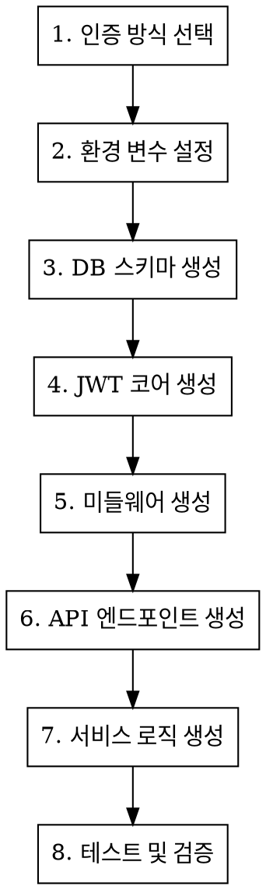

# Auth Module Generator

Next.js 15 App Router 기반 인증 모듈 생성 스킬.

## 지원 인증 방식

| 방식 | 설명 | 파일 |
|------|------|------|
| ID/Password | bcrypt 해싱, JWT 토큰 | `login/route.ts`, `register/route.ts` |
| OAuth | Google, GitHub | `oauth/[provider]/callback/route.ts` |
| Magic Link | 이메일 일회용 링크 | `magic-link/route.ts` |

## 아키텍처 개요

```
src/
├── app/api/auth/           # API 엔드포인트
│   ├── login/              # POST - JWT 로그인
│   ├── register/           # POST - 회원가입
│   ├── logout/             # POST - 로그아웃
│   ├── refresh/            # POST - 토큰 갱신
│   ├── me/                 # GET - 현재 사용자
│   ├── oauth/
│   │   ├── login/          # POST - OAuth 시작
│   │   ├── google/callback/# GET - Google 콜백
│   │   └── github/callback/# GET - GitHub 콜백
│   └── magic-link/
│       ├── send/           # POST - 링크 발송
│       └── verify/         # GET - 링크 검증
├── shared/@withwiz/
│   ├── auth/core/jwt/      # JWT Manager (프로젝트 독립적)
│   └── middleware/         # 인증 미들웨어
└── lib/
    ├── services/auth/      # 인증 서비스
    └── utils/              # jwt.ts, oauth.ts
```

## 생성 워크플로우



## 1. 환경 변수 설정

```env
# JWT 설정 (필수)
JWT_SECRET=<최소 32자 비밀키>
JWT_EXPIRES_IN=7d
JWT_REFRESH_TOKEN_EXPIRES_IN=30d

# OAuth - Google (선택)
GOOGLE_CLIENT_ID=
GOOGLE_CLIENT_SECRET=
GOOGLE_REDIRECT_URI=http://localhost:3000/api/auth/oauth/google/callback

# OAuth - GitHub (선택)
GITHUB_CLIENT_ID=
GITHUB_CLIENT_SECRET=
GITHUB_REDIRECT_URI=http://localhost:3000/api/auth/oauth/github/callback

# Magic Link (선택)
MAGIC_LINK_SECRET=<32자 비밀키>
MAGIC_LINK_EXPIRES_IN=15m
EMAIL_FROM=noreply@example.com

# Redis (토큰 블랙리스트용)
UPSTASH_REDIS_REST_URL=
UPSTASH_REDIS_REST_TOKEN=
```

## 2. Prisma 스키마

```prisma
model User {
  id            String    @id @default(cuid())
  email         String    @unique
  password      String?   // OAuth 전용 사용자는 null
  name          String?
  role          Role      @default(USER)
  emailVerified DateTime?
  isActive      Boolean   @default(true)

  oauthAccounts OAuthAccount[]
  magicLinks    MagicLink[]

  lastLoginAt   DateTime?
  lastLoginIp   String?
  createdAt     DateTime  @default(now())
  updatedAt     DateTime  @updatedAt
}

model OAuthAccount {
  id            String   @id @default(cuid())
  userId        String
  provider      String   // 'google' | 'github'
  providerId    String
  accessToken   String?
  refreshToken  String?

  user          User     @relation(fields: [userId], references: [id])

  @@unique([provider, providerId])
}

model MagicLink {
  id        String   @id @default(cuid())
  userId    String
  token     String   @unique
  expiresAt DateTime
  usedAt    DateTime?

  user      User     @relation(fields: [userId], references: [id])
}

enum Role {
  USER
  ADMIN
}
```

## 3. JWT Manager 구현

### 핵심 구조

```typescript
// src/shared/@withwiz/auth/core/jwt/index.ts
import { SignJWT, jwtVerify } from 'jose';

export class JWTManager {
  private secret: Uint8Array;

  constructor(config: JWTConfig) {
    this.secret = new TextEncoder().encode(config.secret);
  }

  async createAccessToken(payload: IAccessTokenPayload): Promise<string> {
    return new SignJWT({ ...payload })
      .setProtectedHeader({ alg: 'HS256' })
      .setIssuedAt()
      .setExpirationTime(this.config.accessTokenExpiry)
      .sign(this.secret);
  }

  async createRefreshToken(userId: string): Promise<string> {
    return new SignJWT({ userId, tokenType: 'refresh' })
      .setProtectedHeader({ alg: 'HS256' })
      .setIssuedAt()
      .setExpirationTime(this.config.refreshTokenExpiry)
      .sign(this.secret);
  }

  async verifyAccessToken(token: string): Promise<IAccessTokenPayload> {
    const { payload } = await jwtVerify(token, this.secret);
    return payload as IAccessTokenPayload;
  }

  extractTokenFromHeader(authHeader: string | null): string | null {
    if (!authHeader?.startsWith('Bearer ')) return null;
    return authHeader.slice(7);
  }
}
```

### 타입 정의

```typescript
// src/shared/@withwiz/auth/core/jwt/types.ts
export interface JWTConfig {
  secret: string;              // 최소 32자
  accessTokenExpiry: string;   // e.g., '7d'
  refreshTokenExpiry: string;  // e.g., '30d'
  algorithm: 'HS256';
}

export interface IAccessTokenPayload {
  userId: string;
  email: string;
  role: 'USER' | 'ADMIN';
  emailVerified: Date | null;
  iat: number;
  exp: number;
}

export interface IRefreshTokenPayload {
  userId: string;
  tokenType: 'refresh';
  iat: number;
  exp: number;
}
```

## 4. 인증 미들웨어

```typescript
// src/shared/@withwiz/middleware/auth.ts
export const authMiddleware: TApiMiddleware = async (context, next) => {
  const jwtManager = getJWTManager();

  // 1. 토큰 추출
  const authHeader = context.request.headers.get('authorization');
  const token = jwtManager.extractTokenFromHeader(authHeader);
  if (!token) {
    throw new AppError(UNAUTHORIZED.code);
  }

  // 2. 블랙리스트 확인
  const isRevoked = await isAccessTokenRevoked(token);
  if (isRevoked) {
    throw new AppError(INVALID_TOKEN.code, 'Token has been revoked');
  }

  // 3. 토큰 검증
  const payload = await jwtManager.verifyAccessToken(token);

  // 4. 컨텍스트에 사용자 정보 추가
  context.user = {
    id: payload.userId,
    email: payload.email,
    role: payload.role,
  };

  return await next();
};
```

### API 래퍼 함수

```typescript
// src/shared/@withwiz/middleware/wrappers.ts
export function withPublicApi(handler: ApiHandler) {
  return applyMiddleware(handler, [
    errorHandlerMiddleware,
    securityMiddleware,
    corsMiddleware,
    initRequestMiddleware,
    rateLimitMiddleware.api,
    responseLoggerMiddleware,
  ]);
}

export function withAuthApi(handler: ApiHandler) {
  return applyMiddleware(handler, [
    errorHandlerMiddleware,
    securityMiddleware,
    corsMiddleware,
    initRequestMiddleware,
    authMiddleware,  // JWT 검증 추가
    rateLimitMiddleware.api,
    responseLoggerMiddleware,
  ]);
}

export function withAdminApi(handler: ApiHandler) {
  return applyMiddleware(handler, [
    // ...withAuthApi 미들웨어 +
    adminMiddleware,  // role === 'ADMIN' 확인
  ]);
}
```

## 5. API 엔드포인트 구현

### 5.1 로그인 (ID/Password)

```typescript
// src/app/api/auth/login/route.ts
import { withPublicApi } from '@/shared/@withwiz/middleware/wrappers';

const loginSchema = z.object({
  email: z.string().email(),
  password: z.string().min(1),
});

export const POST = withPublicApi(async (context) => {
  const body = await context.request.json();
  const { email, password } = loginSchema.parse(body);

  // 1. 사용자 조회
  const user = await prisma.user.findUnique({ where: { email } });
  if (!user || !user.password) {
    throw new AppError(UNAUTHORIZED.code, 'Invalid credentials');
  }

  // 2. 비밀번호 검증
  const isValid = await bcrypt.compare(password, user.password);
  if (!isValid) {
    throw new AppError(UNAUTHORIZED.code, 'Invalid credentials');
  }

  // 3. 이메일 인증 확인
  if (!user.emailVerified) {
    throw new AppError(EMAIL_NOT_VERIFIED.code);
  }

  // 4. 계정 활성화 확인
  if (!user.isActive) {
    throw new AppError(ACCOUNT_DISABLED.code);
  }

  // 5. 토큰 발급
  const { accessToken, refreshToken } = await createTokenPair(user);

  // 6. 로그인 이력 기록
  await updateLastLoginAt(user.id, context);

  return NextResponse.json({
    accessToken,
    refreshToken,
    user: sanitizeUser(user),
  });
});
```

### 5.2 OAuth 로그인 시작

```typescript
// src/app/api/auth/oauth/login/route.ts
const oauthSchema = z.object({
  provider: z.enum(['google', 'github']),
});

export const POST = withPublicApi(async (context) => {
  const { provider } = oauthSchema.parse(await context.request.json());

  // CSRF 보호용 state 생성
  const state = randomBytes(32).toString('hex');
  const loginUrl = getOAuthLoginUrl(provider, state);

  return NextResponse.json({ loginUrl, provider, state });
});
```

### 5.3 OAuth 콜백 (Google)

```typescript
// src/app/api/auth/oauth/google/callback/route.ts
export async function GET(request: NextRequest) {
  const code = request.nextUrl.searchParams.get('code');
  const error = request.nextUrl.searchParams.get('error');

  if (error || !code) {
    return NextResponse.redirect('/auth/error?reason=oauth_denied');
  }

  try {
    // 1. 코드 → 토큰 교환
    const oauthToken = await exchangeGoogleCodeForToken(code);

    // 2. 사용자 정보 조회
    const oauthUser = await getGoogleUserInfo(oauthToken.access_token);
    const normalizedUser = normalizeGoogleUser(oauthUser);

    // 3. 사용자 생성 또는 조회
    const user = await findOrCreateOAuthUser(normalizedUser, 'google');

    // 4. JWT 토큰 발급
    const { accessToken, refreshToken } = await createTokenPair(user);

    // 5. 성공 페이지로 리다이렉트
    const successUrl = new URL('/auth/oauth/success', request.url);
    successUrl.searchParams.set('accessToken', accessToken);
    successUrl.searchParams.set('refreshToken', refreshToken);
    successUrl.searchParams.set('provider', 'google');

    return NextResponse.redirect(successUrl);
  } catch (error) {
    return NextResponse.redirect('/auth/error?reason=oauth_failed');
  }
}
```

### 5.4 Magic Link 발송

```typescript
// src/app/api/auth/magic-link/send/route.ts
const sendSchema = z.object({
  email: z.string().email(),
});

export const POST = withPublicApi(async (context) => {
  const { email } = sendSchema.parse(await context.request.json());

  // 1. 사용자 조회 또는 생성
  let user = await prisma.user.findUnique({ where: { email } });
  if (!user) {
    user = await prisma.user.create({
      data: { email, emailVerified: new Date() },
    });
  }

  // 2. 기존 미사용 링크 무효화
  await prisma.magicLink.updateMany({
    where: { userId: user.id, usedAt: null },
    data: { usedAt: new Date() },
  });

  // 3. 새 Magic Link 생성
  const token = randomBytes(32).toString('hex');
  const expiresAt = new Date(Date.now() + 15 * 60 * 1000); // 15분

  await prisma.magicLink.create({
    data: { userId: user.id, token, expiresAt },
  });

  // 4. 이메일 발송
  const magicUrl = `${process.env.NEXT_PUBLIC_APP_URL}/auth/magic-link?token=${token}`;
  await sendMagicLinkEmail(email, magicUrl);

  return NextResponse.json({ message: 'Magic link sent' });
});
```

### 5.5 Magic Link 검증

```typescript
// src/app/api/auth/magic-link/verify/route.ts
export async function GET(request: NextRequest) {
  const token = request.nextUrl.searchParams.get('token');

  if (!token) {
    return NextResponse.redirect('/auth/error?reason=invalid_link');
  }

  // 1. 링크 조회
  const magicLink = await prisma.magicLink.findUnique({
    where: { token },
    include: { user: true },
  });

  // 2. 유효성 검증
  if (!magicLink || magicLink.usedAt || magicLink.expiresAt < new Date()) {
    return NextResponse.redirect('/auth/error?reason=expired_link');
  }

  // 3. 링크 사용 처리
  await prisma.magicLink.update({
    where: { id: magicLink.id },
    data: { usedAt: new Date() },
  });

  // 4. JWT 토큰 발급
  const { accessToken, refreshToken } = await createTokenPair(magicLink.user);

  // 5. 성공 리다이렉트
  const successUrl = new URL('/auth/magic-link/success', request.url);
  successUrl.searchParams.set('accessToken', accessToken);
  successUrl.searchParams.set('refreshToken', refreshToken);

  return NextResponse.redirect(successUrl);
}
```

### 5.6 토큰 갱신

```typescript
// src/app/api/auth/refresh/route.ts
const refreshSchema = z.object({
  refreshToken: z.string(),
});

export const POST = withPublicApi(async (context) => {
  const { refreshToken } = refreshSchema.parse(await context.request.json());

  // 1. Refresh Token 검증
  const payload = await verifyRefreshToken(refreshToken);

  // 2. 블랙리스트 확인
  const isRevoked = await isTokenRevoked(refreshToken);
  if (isRevoked) {
    throw new AppError(INVALID_TOKEN.code, 'Token has been revoked');
  }

  // 3. 사용자 조회
  const user = await prisma.user.findUnique({
    where: { id: payload.userId },
  });

  if (!user || !user.isActive) {
    throw new AppError(ACCOUNT_DISABLED.code);
  }

  // 4. 새 토큰 쌍 발급
  const tokens = await createTokenPair(user);

  return NextResponse.json({
    ...tokens,
    user: sanitizeUser(user),
  });
});
```

### 5.7 로그아웃

```typescript
// src/app/api/auth/logout/route.ts
export const POST = withAuthApi(async (context) => {
  const { refreshToken } = await context.request.json();

  // Access Token 추출
  const authHeader = context.request.headers.get('authorization');
  const accessToken = extractTokenFromHeader(authHeader);

  // 토큰 블랙리스트 추가
  if (accessToken) {
    await revokeAccessToken(accessToken, 7 * 24 * 60 * 60); // 7일
  }
  if (refreshToken) {
    await revokeToken(refreshToken, 30 * 24 * 60 * 60); // 30일
  }

  return NextResponse.json({ message: 'Logged out successfully' });
});
```

## 6. OAuth 유틸리티

```typescript
// src/lib/utils/oauth.ts
export function getOAuthLoginUrl(provider: string, state: string): string {
  const config = getOAuthConfig(provider);
  const params = new URLSearchParams({
    client_id: config.clientId,
    redirect_uri: config.redirectUri,
    state,
    response_type: 'code',
    scope: config.scope,
  });

  return `${config.authUrl}?${params.toString()}`;
}

export async function exchangeGoogleCodeForToken(code: string) {
  const response = await fetch('https://oauth2.googleapis.com/token', {
    method: 'POST',
    headers: { 'Content-Type': 'application/x-www-form-urlencoded' },
    body: new URLSearchParams({
      code,
      client_id: process.env.GOOGLE_CLIENT_ID!,
      client_secret: process.env.GOOGLE_CLIENT_SECRET!,
      redirect_uri: process.env.GOOGLE_REDIRECT_URI!,
      grant_type: 'authorization_code',
    }),
  });

  return response.json();
}

export async function getGoogleUserInfo(accessToken: string) {
  const response = await fetch(
    'https://www.googleapis.com/oauth2/v2/userinfo',
    { headers: { Authorization: `Bearer ${accessToken}` } }
  );

  return response.json();
}
```

## 7. 토큰 블랙리스트 서비스

```typescript
// src/lib/services/auth/refreshTokenService.ts
class RefreshTokenService {
  private inMemoryBlacklist = new Map<string, number>();

  async revokeToken(token: string, ttlSeconds: number): Promise<void> {
    const hash = this.hashToken(token);
    const expiresAt = Date.now() + ttlSeconds * 1000;

    // Redis 저장 시도
    try {
      await redis.set(`revoked:${hash}`, '1', { ex: ttlSeconds });
    } catch {
      // Redis 실패 시 인메모리 폴백
    }

    // 인메모리 저장 (항상)
    this.inMemoryBlacklist.set(hash, expiresAt);
  }

  async isTokenRevoked(token: string): Promise<boolean> {
    const hash = this.hashToken(token);

    // 인메모리 먼저 확인 (빠름)
    const inMemory = this.inMemoryBlacklist.get(hash);
    if (inMemory && inMemory > Date.now()) {
      return true;
    }

    // Redis 확인
    try {
      const revoked = await redis.get(`revoked:${hash}`);
      return !!revoked;
    } catch {
      return false;
    }
  }

  private hashToken(token: string): string {
    return createHash('sha256').update(token).digest('hex');
  }
}
```

## 8. 에러 코드 정의

```typescript
// src/shared/@withwiz/errors/codes.ts
export const AUTH_ERRORS = {
  UNAUTHORIZED: { code: 40101, status: 401, key: 'UNAUTHORIZED' },
  INVALID_TOKEN: { code: 40102, status: 401, key: 'INVALID_TOKEN' },
  TOKEN_EXPIRED: { code: 40103, status: 401, key: 'TOKEN_EXPIRED' },
  ACCOUNT_DISABLED: { code: 40301, status: 403, key: 'ACCOUNT_DISABLED' },
  EMAIL_NOT_VERIFIED: { code: 40305, status: 403, key: 'EMAIL_NOT_VERIFIED' },
  OAUTH_FAILED: { code: 40106, status: 401, key: 'OAUTH_FAILED' },
  MAGIC_LINK_EXPIRED: { code: 40107, status: 401, key: 'MAGIC_LINK_EXPIRED' },
};
```

## 9. 클라이언트 통합

### HttpOnly Cookie 설정 (권장)

```typescript
// 로그인 응답에서 쿠키 설정
const response = NextResponse.json({ user });
response.cookies.set('accessToken', accessToken, {
  httpOnly: true,
  secure: process.env.NODE_ENV === 'production',
  sameSite: 'lax',
  maxAge: 7 * 24 * 60 * 60, // 7일
  path: '/',
});
response.cookies.set('refreshToken', refreshToken, {
  httpOnly: true,
  secure: process.env.NODE_ENV === 'production',
  sameSite: 'lax',
  maxAge: 30 * 24 * 60 * 60, // 30일
  path: '/',
});
```

### React Context 예시

```typescript
// src/contexts/AuthContext.tsx
export function AuthProvider({ children }: { children: React.ReactNode }) {
  const [user, setUser] = useState<User | null>(null);

  const login = async (email: string, password: string) => {
    const res = await fetch('/api/auth/login', {
      method: 'POST',
      body: JSON.stringify({ email, password }),
      credentials: 'include', // 쿠키 포함
    });
    const data = await res.json();
    setUser(data.user);
  };

  const logout = async () => {
    await fetch('/api/auth/logout', {
      method: 'POST',
      credentials: 'include',
    });
    setUser(null);
  };

  return (
    <AuthContext.Provider value={{ user, login, logout }}>
      {children}
    </AuthContext.Provider>
  );
}
```

## 체크리스트

생성 시 확인할 항목:

- [ ] JWT_SECRET 32자 이상 설정
- [ ] Prisma 스키마에 User, OAuthAccount, MagicLink 모델 추가
- [ ] OAuth 제공자 콘솔에서 Redirect URI 설정
- [ ] 이메일 발송 서비스 연동 (Magic Link용)
- [ ] Redis 연결 설정 (토큰 블랙리스트용)
- [ ] Rate Limiting 설정
- [ ] 에러 코드 및 메시지 정의
- [ ] 로그인/로그아웃 후 리다이렉트 경로 설정

## 보안 고려사항

| 항목 | 구현 |
|------|------|
| 비밀번호 | bcrypt 해싱 (salt rounds: 10+) |
| JWT | HS256 알고리즘, HttpOnly 쿠키 저장 |
| OAuth | CSRF 보호 (state 파라미터) |
| Magic Link | 15분 만료, 일회용, 토큰 해시 저장 |
| Rate Limit | 로그인 분당 10회, API 분당 120회 |
| 토큰 무효화 | Redis + 인메모리 하이브리드 블랙리스트 |
